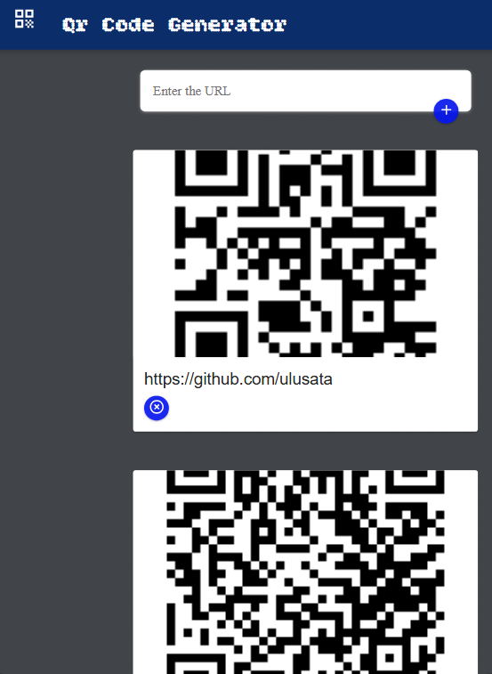
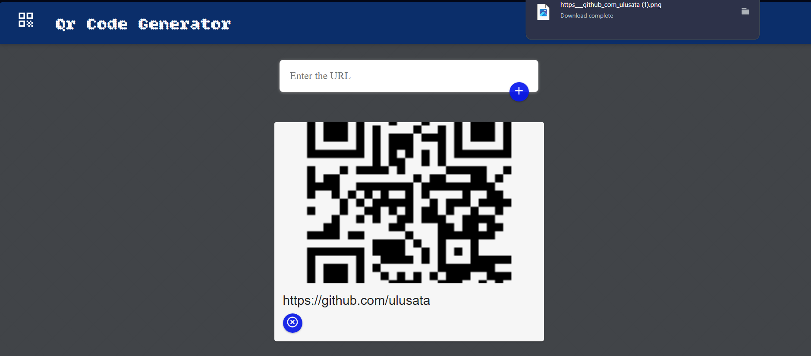

# QR Code Generator 🧾⚡

A fullstack web application that allows users to generate QR codes dynamically from URLs and download them easily.

## 🚀 Features

- 🔗 **Enter any URL** to instantly generate a unique QR code
- 🖼️ **Preview QR code** on the fly
- 📥 **Download** the QR code image in PNG format
- 🗃️ **Persistent storage** of generated codes
- 🗑️ **Delete existing QR codes** through the interface
- 💡 Built with a modular, maintainable architecture

## 🛠️ Tech Stack

- **Frontend**: [React](https://react.dev/) (Vite)
- **Backend**: [Express.js](https://expressjs.com/)
- **QR Code Generator**: [`qr-image`](https://www.npmjs.com/package/qr-image) NPM package
- **Styling**: Material UI / Custom CSS
- **Hosting**: Locally or can be deployed to platforms like Vercel, Railway, Render

## ⚙️ Setup Instructions

### 1. Clone the repository

```bash
git clone https://github.com/ulusata/QRCode-Generator.git
cd QRCode-Generator
```

### 2. Install Dependencies

```bash
cd client
npm install

cd ../server
npm install
```

### 3. Run the App

```bash
node qrApi.js

cd ../client
npm run dev
```

Then open http://localhost:5173 in your browser.

## 📸 Screenshots






Feel free to use, modify, and distribute it
